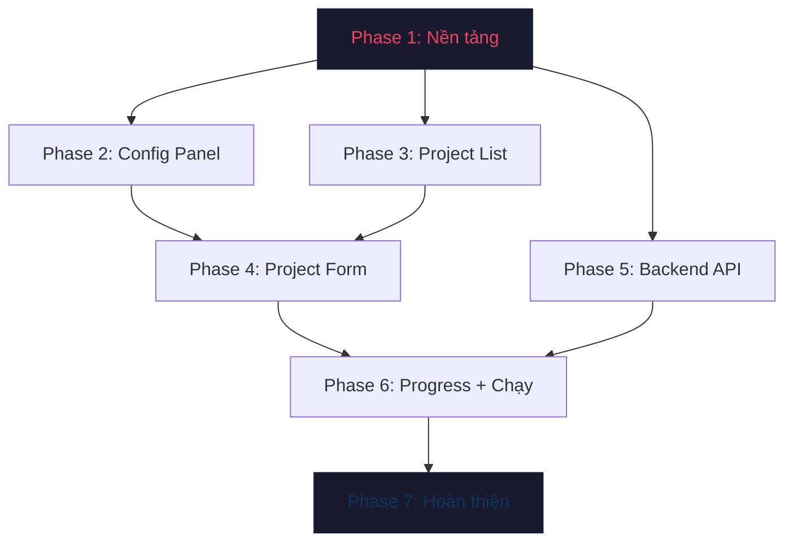

# 🖥️ Desktop GUI cho Hệ thống Tạo Video Tự động

## Mục tiêu

Xây dựng giao diện Desktop (CustomTkinter, Dark theme) để quản lý và chạy pipeline tạo video tự động trên Google Flow. Hỗ trợ: import cookies qua file/textbox, quản lý nhiều dự án, chạy tuần tự hoặc song song (1-4 worker), theo dõi tiến trình real-time, và 100% headless (không bao giờ cần mở browser).

---

## Thông tin dự án

| Mục | Giá trị |
|-----|---------|
| **Loại** | Desktop Application (Python) |
| **Tech Stack** | CustomTkinter 5.2+, Pillow, ThreadPoolExecutor |
| **OS** | Windows + macOS (cross-platform) |
| **Entry point** | `python run_gui.py` |
| **Nguyên tắc** | Không phá code cũ. Code CLI (`main.py`, `src/main.py`) vẫn hoạt động độc lập |

---

## Tiêu chí thành công

- [ ] GUI khởi chạy thành công trên Windows (Dark theme, 1200×800)
- [ ] Import cookies từ file hoặc dán textbox → validate → lưu
- [ ] Tạo/Sửa/Clone/Xóa dự án qua giao diện
- [ ] Chạy automation headless → hiển thị tiến trình real-time
- [ ] Chạy song song nhiều worker (1-4)
- [ ] Nút "Dừng" hoạt động chính xác

---

## Cấu trúc thư mục (sau khi hoàn thành)

```
Create_Video/
├── run_gui.py                    ← Entry point GUI
├── gui/
│   ├── __init__.py
│   ├── app.py                    ← Main window + TabView
│   ├── theme.py                  ← Màu sắc, font, constants
│   └── panels/
│       ├── __init__.py
│       ├── config_panel.py       ← Tab Cấu hình
│       ├── project_panel.py      ← Tab Tạo Video (multi-project)
│       └── progress_panel.py     ← Tab Tiến trình
├── src/
│   ├── automation_api.py         ← [MỚI] Backend API wrapper
│   ├── cookie_manager.py         ← [SỬA] Thêm validate + import
│   └── ... (giữ nguyên)
├── requirements.txt              ← [SỬA] Thêm customtkinter, Pillow
└── ... (giữ nguyên)
```

---

## 🔑 Quy tắc thực hiện

1. **Đi chậm mà chắc:** Mỗi Phase hoàn thành → kiểm tra → mới sang Phase tiếp
2. **Không phá code cũ:** Tất cả code GUI nằm trong `gui/`. Code gốc trong `src/` chỉ thêm, không sửa logic hiện có
3. **Test ngay mỗi bước:** Mỗi task có bước VERIFY cụ thể, phải vượt qua mới tiếp tục
4. **Commit thường xuyên:** Sau mỗi Phase, commit git để có điểm rollback

---

## 📋 Kế hoạch thực hiện (7 Phase tuần tự)

---

### 🔷 PHASE 1: Nền tảng — Dependencies & Skeleton

> **Mục tiêu:** Cài đặt thư viện, tạo khung cửa sổ, chạy lên được window trống.

| # | Task | File | Hành động |
|---|------|------|-----------|
| 1.1 | Cập nhật dependencies | `requirements.txt` | Thêm `customtkinter>=5.2.0` và `Pillow>=10.0.0` |
| 1.2 | Cài đặt dependencies | Terminal | `pip install customtkinter Pillow` |
| 1.3 | Tạo cấu trúc thư mục | `gui/`, `gui/panels/` | Tạo folders + `__init__.py` |
| 1.4 | Tạo theme module | `gui/theme.py` | Định nghĩa bảng màu, font, kích thước |
| 1.5 | Tạo app window | `gui/app.py` | `CTk()` 1200×800, Dark mode, 3 tabs trống |
| 1.6 | Tạo entry point | `run_gui.py` | Import và chạy app |

**✅ VERIFY Phase 1:**
```
Chạy: python run_gui.py
Kết quả: Cửa sổ hiện lên, Dark theme, có 3 tab (Cấu hình / Tạo Video / Tiến trình)
         Click chuyển tab được, cửa sổ responsive
```

---

### 🔷 PHASE 2: Tab Cấu hình — JSON & Cookies Import

> **Mục tiêu:** Tab đầu tiên hoạt động: import JSON input, import cookies, chỉnh settings.

| # | Task | File | Hành động |
|---|------|------|-----------|
| 2.1 | Sửa cookie_manager | `src/cookie_manager.py` | Thêm `validate_cookies()` + `import_cookies_from_text()` |
| 2.2 | Xây Config Panel | `gui/panels/config_panel.py` | Tạo layout 3 section: JSON / Cookies / Settings |
| 2.3 | JSON Input zone | (trong config_panel) | Nút "Mở file" + textbox hiển thị + nút "Lưu" |
| 2.4 | Cookies zone | (trong config_panel) | Nút "Import file" + textbox dán + nút "Validate & Lưu" + trạng thái |
| 2.5 | Settings zone | (trong config_panel) | Các ô nhập: RENDER_TIMEOUT, MAX_RETRY, và các config từ `.env` |
| 2.6 | Kết nối vào app | `gui/app.py` | Gắn ConfigPanel vào tab "Cấu hình" |

**✅ VERIFY Phase 2:**
```
1. Mở GUI → Tab "Cấu hình"
2. Bấm "Mở file JSON" → chọn data/sample_input.json → nội dung hiện trong textbox
3. Dán cookies JSON vào textbox → bấm "Validate & Lưu"
   → Thấy "✅ Cookies hợp lệ (X cookies)" hoặc "❌ JSON không hợp lệ"
4. Sửa RENDER_TIMEOUT → bấm Lưu → mở lại app → giá trị giữ nguyên
```

---

### 🔷 PHASE 3: Tab Tạo Video — Danh sách dự án (cột trái)

> **Mục tiêu:** Hiển thị danh sách dự án từ JSON, hỗ trợ Thêm/Clone/Xóa.

| # | Task | File | Hành động |
|---|------|------|-----------|
| 3.1 | Tạo Project Panel | `gui/panels/project_panel.py` | Layout 2 cột (sidebar 30% + detail 70%) |
| 3.2 | Project List widget | (trong project_panel) | Scrollable frame, mỗi item = checkbox + tên + icon trạng thái |
| 3.3 | Load từ JSON | (trong project_panel) | Đọc `sample_input.json` → render danh sách |
| 3.4 | Nút "Thêm mới" | (trong project_panel) | Tạo task trống + thêm vào list + lưu JSON |
| 3.5 | Nút "Clone" | (trong project_panel) | Copy task đang chọn + đổi tên + lưu JSON |
| 3.6 | Nút "Xóa" | (trong project_panel) | Xóa task đang chọn + confirm dialog + lưu JSON |
| 3.7 | Kết nối vào app | `gui/app.py` | Gắn ProjectPanel vào tab "Tạo Video" |

**✅ VERIFY Phase 3:**
```
1. Mở GUI → Tab "Tạo Video"
2. Thấy danh sách dự án bên trái (từ sample_input.json)
3. Bấm "+ Thêm" → dự án mới xuất hiện, JSON file cập nhật
4. Chọn 1 dự án → bấm "Clone" → bản sao xuất hiện
5. Chọn dự án → bấm "Xóa" → confirm → dự án biến mất, JSON cập nhật
```

---

### 🔷 PHASE 4: Tab Tạo Video — Form chi tiết (cột phải)

> **Mục tiêu:** Click vào 1 dự án → form bên phải hiển thị và chỉnh sửa được toàn bộ thông số.

| # | Task | File | Hành động |
|---|------|------|-----------|
| 4.1 | Form chi tiết layout | `gui/panels/project_panel.py` | ScrollableFrame phải: tên, prompt, ảnh, settings, output |
| 4.2 | Tên sản phẩm | (trong project_panel) | `CTkEntry` bind vào task["ten_san_pham"] |
| 4.3 | Prompt editor | (trong project_panel) | `CTkTextbox` multi-line bind vào task["prompt"] |
| 4.4 | Image selector | (trong project_panel) | Nút "Chọn thư mục" + grid thumbnail (Pillow resize) |
| 4.5 | Video settings | (trong project_panel) | Model (OptionMenu), Ratio (SegmentedButton), Quality (OptionMenu), Count (SegmentedButton), Download method (SegmentedButton) |
| 4.6 | Output folder | (trong project_panel) | `CTkEntry` + nút "Chọn" (filedialog.askdirectory) |
| 4.7 | Nút "Lưu" | (trong project_panel) | Thu thập form → cập nhật task object → ghi JSON |
| 4.8 | Đồng bộ 2 cột | (trong project_panel) | Click item trái → load data vào form phải. Sửa form → cập nhật tên ở list |

**✅ VERIFY Phase 4:**
```
1. Click dự án "Ví Nữ..." → form phải hiển thị đầy đủ thông tin
2. Sửa prompt → bấm "Lưu" → mở JSON file → thấy prompt đã cập nhật
3. Chọn thư mục ảnh → thumbnail hiển thị ảnh nhỏ
4. Đổi Model sang "Veo 3.1" → đổi Ratio sang "16:9" → Lưu → JSON cập nhật
5. Tạo dự án mới → điền form → Lưu → JSON cập nhật đúng
```

---

### 🔷 PHASE 5: Backend API — Cầu nối GUI ↔ Automation Engine

> **Mục tiêu:** Tạo lớp API trung gian để GUI gọi automation mà không cần biết nội bộ engine.

| # | Task | File | Hành động |
|---|------|------|-----------|
| 5.1 | Tạo AutomationAPI class | `src/automation_api.py` | Class với callbacks: `on_step`, `on_log`, `on_task_done` |
| 5.2 | GUI Logger handler | `src/automation_api.py` | Custom `logging.Handler` bắt log → gửi qua callback lên GUI |
| 5.3 | Worker đơn (tuần tự) | `src/automation_api.py` | `_run_single_worker(tasks)`: 1 Chrome headless, xử lý tuần tự |
| 5.4 | Worker pool (song song) | `src/automation_api.py` | `ThreadPoolExecutor(max_workers=N)`: mỗi worker = 1 Chrome riêng |
| 5.5 | Stop mechanism | `src/automation_api.py` | `threading.Event` flag: khi set → tất cả worker dừng sau step hiện tại |
| 5.6 | Cookie check trước khi chạy | `src/automation_api.py` | `check_ready()` → kiểm tra cookies tồn tại + hợp lệ |

**✅ VERIFY Phase 5:**
```python
# Test script tạm (chạy trong terminal, không cần GUI):
from src.automation_api import AutomationAPI
api = AutomationAPI()
api.check_ready()  # → True nếu cookies OK, False nếu thiếu
# (Không chạy automation thật, chỉ test khởi tạo + check)
```

---

### 🔷 PHASE 6: Tab Tiến trình — Real-time Progress & Log

> **Mục tiêu:** Khi bấm "Chạy", chuyển sang tab Tiến trình, hiển thị pipeline step + log real-time.

| # | Task | File | Hành động |
|---|------|------|-----------|
| 6.1 | Tạo Progress Panel | `gui/panels/progress_panel.py` | Layout: tổng quan + danh sách task + pipeline steps + log |
| 6.2 | Thanh progress tổng | (trong progress_panel) | `CTkProgressBar` + label "Task X/Y" |
| 6.3 | Pipeline step indicator | (trong progress_panel) | 8 label (navigate→download), đổi màu: xám/xanh dương/xanh lá/đỏ |
| 6.4 | Log viewer | (trong progress_panel) | `CTkTextbox` readonly, auto-scroll, hiển thị timestamp + message |
| 6.5 | Nút "Dừng" | (trong progress_panel) | Gọi `api.stop()` → set flag → worker dừng |
| 6.6 | Kết nối vào app | `gui/app.py` | Gắn ProgressPanel vào tab "Tiến trình" |
| 6.7 | Thanh hành động | `gui/panels/project_panel.py` | Thêm: Chế độ (Tuần tự/Song song) + Workers dropdown + nút "Chạy tất cả" / "Chạy đã chọn" |
| 6.8 | Kết nối nút Chạy → API | `gui/app.py` | Bấm "Chạy" → thu thập tasks → gọi `api.run_tasks()` → chuyển tab → hiện progress |
| 6.9 | Callback → GUI update | `gui/app.py` | `api.on_log` → ghi vào log viewer, `api.on_step` → đổi màu step, `api.on_task_done` → cập nhật progress |

**✅ VERIFY Phase 6:**
```
1. Có cookies hợp lệ + 1 dự án pending
2. Bấm "Chạy tất cả" → GUI chuyển sang tab "Tiến trình"
3. Step "navigate" sáng xanh dương → hoàn thành → xanh lá → step tiếp theo
4. Log viewer cuộn theo, hiển thị thông báo real-time
5. Bấm "Dừng" → pipeline dừng sau step hiện tại → log hiện "Pipeline stopped"
6. Thử song song 2 worker → 2 task chạy đồng thời → log ghi [W1] [W2]
```

---

### 🔷 PHASE 7 (PHASE X): Hoàn thiện & Kiểm tra tổng thể

> **Mục tiêu:** Polish giao diện, xử lý edge cases, test end-to-end.

| # | Task | Hành động |
|---|------|-----------|
| 7.1 | Error handling toàn diện | Try/catch cho mọi file I/O, messagebox lỗi thân thiện |
| 7.2 | State persistence | Ghi nhớ lần chạy cuối: tab đang mở, window size, chế độ chạy |
| 7.3 | Keyboard shortcuts | Ctrl+S = Lưu, Ctrl+R = Chạy, Esc = Dừng |
| 7.4 | Cross-platform check | Test trên Windows (đã có) + kiểm tra path separator cho macOS |
| 7.5 | Cập nhật README.md | Thêm hướng dẫn cài đặt và sử dụng GUI |
| 7.6 | Git commit final | Commit toàn bộ code GUI |

**✅ VERIFY Phase 7 (Final):**
```
- [ ] GUI khởi chạy không lỗi (python run_gui.py)
- [ ] Import cookies → validate → hiện trạng thái
- [ ] Tạo 3 dự án mới → điền form → Lưu → JSON đúng
- [ ] Clone + Xóa dự án hoạt động
- [ ] Chạy 1 dự án headless → tiến trình hiển thị → hoàn tất
- [ ] Chạy 2 dự án song song (2 workers) → cả 2 tiến triển
- [ ] Bấm "Dừng" giữa chừng → pipeline dừng an toàn
- [ ] Đóng app → mở lại → trạng thái giữ nguyên
```

---

## Sơ đồ phụ thuộc giữa các Phase



> **Đường đi chính:** P1 → P2 → P3 → P4 → P5 → P6 → P7
> **Có thể làm song song:** P2 & P3 (không phụ thuộc nhau), P4 & P5 (khác module)

---

## Lưu ý quan trọng

> [!IMPORTANT]
> **Headless mode:** Hệ thống luôn chạy `--headless=new`. Cookies được import qua GUI, không bao giờ mở browser.

> [!WARNING]
> **Song song:** Mỗi Chrome headless ~500MB RAM. Máy 8GB → tối đa 2 worker. 16GB → tối đa 4 worker.

> [!TIP]
> **Rollback:** Sau mỗi Phase, chạy `git add -A && git commit -m "Phase X complete"` để có điểm khôi phục.
